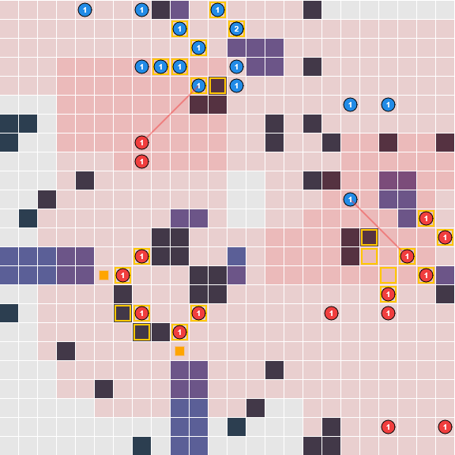

## Repository for my submission to the [Lux AI Season 3](https://www.kaggle.com/competitions/lux-ai-season-3/overview) challenge by NeurIPS

# Game description
The game is set in a 2D gridworld environment with two players competing on who can gain the most points in a given match. A full description can be found [here](https://www.kaggle.com/competitions/lux-ai-season-3/overview)

Each player has a fixed amount of units. In each step of the environment, a unit can either move to a neighboring tile or perform a sap action on one tile. Each unit has an energy reserve, with moving draining energy and sapping also reducing energy of units performing the action and any enemy unit hit. Certain tiles on the map are fragment tiles, which give a player one point per time step that it is occupied. The map also features asteroid tiles, which are impassible, and nebula tiles, which reduce vision/energy. Furthermore each tile on the grid has an energy value associated with it, that increases/decreases the energy of any unit occupying that tile for a given timestep.

The complexity of the game is increased by several factors:
- The environment is not fully observable, only tiles within the vision range of a player's units are known at each step. This also includes enemy positions.
- Fragment tiles (point tiles) are invisble and have to be identified through trial and error.
- The starting environment and several game parameters are randomly sampled at the beginning and consequently, they are different for each game.
- The map changes during the course of a match. Asteroid tiles, nebula tiles and the energy grid of the tiles move at specific intervals
- Some of the game parameters are not observable and have to be determined through exploration

Each game consists of 5 matches on the same map. Each match is 100 timesteps.

Submitted agents are pitting against each other in a randomized tournament resulting in the [leaderboard](https://www.kaggle.com/competitions/lux-ai-season-3/leaderboard?)

# Solutions

## Rule-based
The final submission to the challenge is an entirely rule-based agent which can be found [here](https://github.com/LenMetz/NeurIPS-Lux-AI-S3/blob/main/agent_dev.ipynb). Older iterations are stored for evaluation in [here](https://github.com/LenMetz/NeurIPS-Lux-AI-S3/blob/main/old_agents.py). Every element is implemented from scratch using Numpy/PyTorch.

In the following I will lay out basic components of the agent, the control of the units and a number of minor additions to optimize the performance in different match situations. It should be noted that a full understanding of the game environment is necessary for these explanations.

### Mapping
Since the map is only partially observable, it is vital to store/infer all possible information about the map. This is divided into 3 separate maps that can be found [here](https://github.com/LenMetz/NeurIPS-Lux-AI-S3/blob/main/maps.py). An energy map, a map for the fragments and a map for the tile types.
#### Energy map
There are always two energy nodes on the map, which affect the energy of each tile with: $e=sin(1.2\times d+1)\times4$, where $d$ is the manhatten distance from the tile to the energy node. This calculation is done for every tile for both nodes and added together. Since the position of the two energy nodes is mirrored along the anti-diagonal of the map, there are only $576/2 + 12=300$ unique energy node configuration for the game. In a given match, I compare the observed energy map of the tiles to all possible configurations and select the first one that matches in all visible tiles. This map is then used for all non-visible tiles. At each subsequent step of the environment I check if any visible tiles don't match the assumed energy map and redo the selection from the 300 possible maps if this is the case. This implicitely identifies movement in the energy map. Since the maps are fairly dissimilar, I observed I find the correct energy map in essentially all steps. 
#### Tile map
In the tile map class I store a the type of every tile and which tiles are known/unknown. At every step of the environment I store the types of the currently visible tiles. Additionally, I check whether the type of all visible tiles matches their stored type. If not, then a shift in the map has occured. I subsequently identify the shift direction and shift the stored map accordingly. Even though the shifts happen at fixed intervals, I do not keep track of this and simply check at every step if the map has shifted. While this method works perfectly well for mapping the current tile type as best as possible, anticipating map movement would be helpful.
Lastly I also store a tile "age" in this class. This is a simple integer per tile which indicates the steps since the agent last observed this tile. This feature is used for exploration.

#### Fragment map
This map stores two internal maps of the game environment. A map that indicates all possible locations of fragment tiles and a map that indicates known locations. If a relic tile is observed, this the 5 x 5 square around the relic tile is set as possible fragments. At each step of the environment this class checks the increase in points against the positions of all units on possible and known fragment tiles. The number of units on known fragment tiles is subtracted from the increase in points. If the number of remaining points matches the number of units on possible fragment tiles, these tiles are marked as known fragments (and no longer possible). If after subtracting known points the remainder is 0 all occupied possible fragment tiles are set as no longer possible.
One issue that arises in this approach is, that, there could be more units on possible tiles than there are unexplained points left. Meaning only some units are on fragment tiles, while the others are on empty tiles. Which units are the point-giving ones and which aren't is cannot be directly determined in this single step. My solution is that for one step, I only allow one unit to move onto a possible fragment tile. If multiple units are on possible fragment tiles and their actual fragment locations cannot be directly deduced (if for example the relic spawns in with multiple units around it), I move all but one unit away from the possible tiles.

It should be noted, that this approach for conflicts in the attribution of points to occupied tiles is in all likelihood suboptimal. I experimented with assigning probabilities to tiles and updating them over the subsequent observations, but this didn't yield a satisfying solution. There were often cases with too many conflicting units on too many possible fragments and at the very least it took too many steps until this converged to 100% certainty for all tiles.

### Identifying unknown game parameters

#### unit_sap_dropoff_factor and unit_energy_void_factor
The former is vital in identifying optimal tiles to sap. The latter was not used in any part of my strategy, but it is very necessary in calculating the former when sapping is done to enemy units that are also being affected by the void.
My approach is essentially just calculating the energy change for enemy units and checking which of the possible values for the two parameters line up with this change and the actions I took.

#### unit_move_cost and nebula_energy_tile_energy_reduction
Both of these can be directly deduced from the energy change of a unit that is known to have moved or be on a nebula tile. I did not calculate the vision reduction and did not factor this is in any part of my strategy.

### Strategy
At each step every unit is assigned a role and a target to move towards based on its role:

#### 0: Exploring
Units move towards a tile in order to explore parts of the map and find relic tiles. 
For a given unit, I assign every tile a score based on the "age" from the tile class and subtract the manhatten distance. So a combination of the how long the tiles haven't been visible and how far they are away. Then the unit targets the tile with the highest score. I also subtracted some points of the score for tiles close to the edge because occupying those tiles effectively reduces the vision of a unit and diminishes the exploration.

#### 1: Possible/known fragments
These units move towards possible or known fragment tiles

#### 2: Occupying known fragments
Units that occupy known fragments and are actively extracting points.

#### 3: Attacking/Defending
Attacking units move towards fragment tiles on the enemy half of the map. Defending units occupy high-energy tiles around fragment tiles of the own half of the map

### Role assignment

The basic role is exploring. If no relic tiles are known all units explore. As soon as a relic tile is found, all units move to identify which tiles around it are fragment tiles. Any unit that occupies a fragment tile is then assigned the 2 role and no longer used to target other tiles (it is likely suboptimal to fix these units to occupying indefinitely as they make easy targets for sapping). For each possible/known fragment tiles only one, the closest, unit is chosen to target this tile. All leftover units are set to attacking/defending.

Minor details:
- In matches 2 and 3 of a game, two and one units are reserved for exploring to find newly spawning relic tiles.
- If the number of fragment tiles is lower than the number of available units, a few units are reserved for attacking, even if they are closest to fragment tiles. This

### Movement of units
All units are assigned a target based on their role. The move action to take is determined using the [A* pathfinding algorithm](https://en.wikipedia.org/wiki/A*_search_algorithm). My implementation of A* has two modes, quickest path and highest energy remaining.
#### quickest path
Within A*, all cardinal tiles are considered adjacent neighbors. The distance function to a neighbor is move cost of the match. If a neighbor is an asteroid tile, a movecost of $10^{9}$ is added, ensuring these tiles are ignored if any other path is possible. This algorithm gives the shortest path in number of moves, meaning the unit reaches its target in the least number of moves. In order to ensure a unit doesn't run out of energy, I kept track of the energy of a unit along a given path as it changes with moving and energy from the tiles. If a unit's energy falls below the move cost, the final tile of this path is treated as having no neighbors, making it a deadend.
I haven't verified/proven this, but I believe this implementation always gives the quickest possible path to a target
#### Highest energy
This version of A* works the same as the previous, only that the distance function to a neighbor uses the energy on the neighbor tile. Meaning the higher the neighbor energy is, the shorter the distance. Tile energys are normalized to be equal or greater zero, to prevent the path from doing circles or moving back and forth to farm energy. While this might be an advantageous strategy in some cases, I choose to block A* from doing so.

For every unit I calculate the path to the target unit using A* and the next move is simply to the first element of the path. Attacking/defending and exploration units always use the highest-energy mode. Fragment units use the quickest path if the fragments are close to the starting tile and use highest energy if the tiles are closer to the centre of the map.

Note that role assignments are redone at every time step. Simiarly the paths are recalculated at every step as well. While costly, this ensures the optimal unit for each task is always chosen.

### Additional improvements I did not implement
- Anticipate map movements

## PPO
An attempt for a reinforcement learning (RL) using proximal policy optimization (PPO) can be found [here](https://github.com/LenMetz/NeurIPS-Lux-AI-S3/blob/main/PPO_dev.ipynb). PPO implementation is a modified version of [CleanRL](https://github.com/vwxyzjn/cleanrl/blob/master/cleanrl/ppo.py).

The agent is build on a basic rule-based agent learns maps of the different features of the environment and general game parameters through exploration.

The critic network is a combination of a CNN and a feed-forward network. The CNN gets multiple maps as input (unit positions, enemy positions, energy of each tile, asteroid tiles, fragment tiles) and outputs a hidden state. The feed-forward network uses game parameters to generated a hidden state. Both hidden state are combined with another feed-forward network to generate reward estimate.

The actor network is an encoder-only Transformer that receives the same maps as input as the actor and outputs a hidden state for each unit. The hidden states are passed into a fully-connected network individually and mapped to probabilities for each action. Each unit has 1152 possible actions (targeting any of the 24x24 tiles with either a move or sap action).
The rule-based agent transforms the actions generated by the actor into permissble actions for the environment through a pathfinding algorithm (A*). 

My PPO implementation includes the following modifications to the CleanRL baseline:#
- Compatible with a multi-descrete [gym](https://gymnasium.farama.org/api/spaces/) environment
- Split actor and critic networks
- Seperate learning rates and learning rate schedules for actor and critic
- Policy clip-value annealing
- Early stopping of the actor updates if threshold of KL-divergence between new and old policy is reached, while critic updates continue
- Reward scaling

An agent trained for up to 10M timesteps did not yield any significant results and failed to beat an advanced rule-based agent. Possibe points of failure:
- Mistakes in the implementation
- Network setup unsuited for the task
- Network sizes too small
- Training time too short

## IL
Imitation learning aims to learn to play a game by imitating actions taken by knowledgable players.
In this case, I extracted information from the games of the top 10 players and trained a CNN to imitate their actions given the environment information. This agent was set inside a basic rule-based agent that learns the environment and game parameters during play. The IL agent and trainig setup can be found [here](https://github.com/LenMetz/NeurIPS-Lux-AI-S3/blob/main/aimbot.ipynb).

Similar to PPO, this attempt did not yield a strong agent and failed to beat an advanced rule base agent. Possible points of failure:
- Network setup unsuited for the task
- Network sizes too small
- Training time too short
- Lack of long-term strategy, since agent has no planning feature
